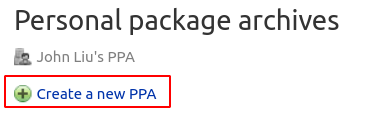

# Add an executable script to an existing Ubuntu package

This document will guide you to:

- Prepare your system

- Retrieve the source code of a existing Ubuntu package

- Add a "testing.sh" script to the package and install it to `/usr/bin/`.

- Add a "post-install" script

- Re-package it as a `deb`

- Upload and host it using your PPA on Launchpad so everyone can install it

I will be using `hello` as an example for re-packaging. I am using Ubuntu 20.04
on a VM, but will give it a try using Docker container.

## Preparation

### Install required packages

1. Make sure you have all the required software installed:

```bash
$ sudo apt install gnupg pbuilder ubuntu-dev-tools apt-file debhelper
```

2. Set up `pbuilder`

`pbuilder` allows you to build packages locally on your machine. It serves a
couple of purposes:

- The build will be done in a minimal and clean environment. This helps you
make sure your builds succeed in a reproducible way, but without modifying your
local system

- There is no need to install all necessary build dependencies locally

- You can set up multiple instances for various Ubuntu and Debian releases

To set `pbuilder` up:
```bash
pbuilder-dist focal create
```

### Generate your GPG key

1. Create a GPG key for signing your packages. Running the command
and follow the instruction to generate one:

```bash
$ gpg --gen-key
```

then you should see a message similar to this one:

```
pub   rsa3072 2020-11-13 [SC] [expires: 2022-11-13]
      CAFE00E471F8828A6DDABE945A6FF8EE7F27A9F0
uid                      John Liu <johnliu55tw@gmail.com>
sub   rsa3072 2020-11-13 [E] [expires: 2022-11-13]
```

The **last eight hexadecimal digits** is the *key ID*, which is `7F27A9F0` in this
case.

> **Note:** You can also run `gpg --full-generate-key` to fine-tune the key
> (encryption algorithm, expiration of the key, ...).

### Launchpad

1. You will need a [Launchpad](https://launchpad.net/+login) account to create
PPA on Launchpad. Click the link to register if you don't have one.

2. Upload the GPG key to Launchpad

  1. keyserver
  2. Launchpad

3. Create a PPA on your profile page.



> **Note:** If you deleted a PPA, you will have to wait up to an hour before
> you can recreate a PPA with the same name.

## Retrieve the source code of a package

First, you need to know the name of the package you want to modify. You could
use [Ubuntu Package Search](https://packages.ubuntu.com/) to search for it.
I will use [hello](https://packages.ubuntu.com/focal/hello), an example package
based on GNU hello, as an example.

The ubuntu-dev-tools has a tool called `pull-lp-source` that we could
use to grab the source code for the "hello" package:

> **Note:** The command will pull multiple files and store into current working
> direction. I would recommend creating a new directory and `cd` into it
> before you run the command.

```bash
$ pull-lp-source hello focal
```

Now you should see several files appeared:

```bash
$ ls -l
drwxrwxr-x 13 johnliu johnliu   4096 Nov 14 01:09 hello-2.10
-rw-rw-r--  1 johnliu johnliu   6560 Nov 13 23:37 hello_2.10-2ubuntu2.debian.tar.xz
-rw-rw-r--  1 johnliu johnliu   1847 Nov 13 23:37 hello_2.10-2ubuntu2.dsc
-rw-rw-r--  1 johnliu johnliu 725946 Nov 13 23:32 hello_2.10.orig.tar.gz
```

## Add an executable script and install it to /usr/bin

Add or modify the file `debian/install` to specify additional files in the
build directory to be installed to the system.

```
testing.sh usr/bin
```

See [here](https://www.debian.org/doc/manuals/maint-guide/dother.en.html#install)
for more about `install` file.

## Add a "post-install" script

Add a file `debian/postinst` would do the job.
Make sure shebang is added and the file is executable:

```bash
#!/bin/sh

echo 'this is a test from John Liu'
```

For custom scripts that runs at different stages when the package is installed,
see [Package maintainer scripts and installation procedure](https://www.debian.org/doc/debian-policy/ch-maintainerscripts.html).

## Re-package it as deb and upload to your PPA

With the changelog entry written and saved, run `debuild` to generate and sign
it:

```bash
$ debuild -S -d
```

Now you can use `dput` command to upload the `*.changes`:
```bash
$ dput ppa:<Your Launchpad ID>/<Your PPA URL> <source.changes>
```

You can check your PPA on Launchpad website for the correct URL.

> **Note:** Launchpad builds the pacakges onsite, and does not accept deb
> files!

You will receive an email that tells you whether the package is successfully
uploaded and accepted. Be sure to check for the email.

## References

- [Ubuntu Packaging Guide](https://packaging.ubuntu.com/html/)

- [Packaging/PPA - Launchpad Help](https://help.launchpad.net/Packaging/PPA)

## Huh?

### Error occurred when I run `debuild` command
```
make: dh: Command not found
```

The `dh` command is provided by package `debhelper`, but is not listed in 
required package in the
[Getting Set Up](https://packaging.ubuntu.com/html/getting-set-up.html) page.

### Error occurred when I run `dput` command
```
Checking signature on .changes
gpg: /home/johnliu/repackage-htop/htop_2.2.0-2ubuntu1_source.changes: error 58: gpgme_op_verify
gpgme_op_verify: GPGME: No data
```

Main cause is that the file `*.changes` is not signed. I have to correct
file `debian/changelog`:

- UNRELEASED

### Create patch for the `testing.sh`

Following article
[Fixing a bug in Ubuntu](https://packaging.ubuntu.com/html/fixing-a-bug.html),
when I try to create a new patch using command `edit-patch 99-new-patch`, some
error occurred:
```bash
Normalizing patch path to 99-new-patch
Normalizing patch name to 99-new-patch.patch
No series file found
```

Main cause is that the `hello` package does not have any patches so
`debian/patches/series` cannot be found. Need to create a patch for it.

### The permission of "testing.sh" after installed to /usr/bin

The permission of the file is 644, but after it got installed to `/usr/bin`,
it becomes 755. Maybe there are some rules that automatically changed the
permission because I want it in `/usr/bin`?
