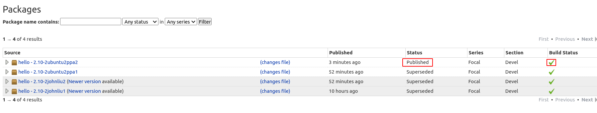
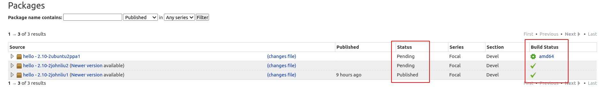

# Modify an existing Ubuntu package

This document will guide you through the steps required to modify an existing
Ubuntu package and upload it to your Personal Package Archive (PPA). The steps
are:

1. Set up your system and your Launchpad account

2. Retrieve the source code of an existing Ubuntu package

3. Add a "testing.sh" script to the package and install it to `/usr/bin/`

4. Add a "post-install" script

5. Re-package it as a `deb` and test it

6. Host the package using your PPA on Launchpad to distribute it

I'm running Ubuntu 20.04 (focal) in a VM.

## Set up your system and your Launchpad account

### Install and configure required packages

Make sure you have all the required software installed:

```bash
$ sudo apt install gnupg pbuilder ubuntu-dev-tools apt-file debhelper
```

Then you need to set up `pbuilder`:

```bash
$ pbuilder-dist focal create
```

I'm running Ubuntu 20.04 so I'm using `focal`. Make sure you have the
right release name here.

### Generate your GPG key

You need a GPG key to sign your packages. Running the command and follow the
instruction to generate one:

```bash
$ gpg --gen-key
```

At last you should see a message similar to this:

```
pub   rsa3072 2020-11-14 [SC] [expires: 2022-11-14]
      2734D5090EEC923C2FAB20373EAFB4567F851F68
uid                      John Liu <johnliu55tw@gmail.com>
sub   rsa3072 2020-11-14 [E] [expires: 2022-11-14
```

- **Note:** You can also run `gpg --full-generate-key` to fine-tune the key
  (encryption algorithm, expiration of the key, ...).

### Create Launchpad account and import your GPG key

You will need a [Launchpad](https://launchpad.net/+login) account to host a PPA
on Launchpad. Click the link to register if you don't have one. After you got
an account, upload your GPG key to Launchpad.

Retrieve the **fingerprint** of your GPG key with the following command:

```bash
$ gpg --fingerprint <Your email>
```

It will print out the GPG fingerprint:

```
pub   rsa3072 2020-11-14 [SC] [expires: 2022-11-14]
      2734 D509 0EEC 923C 2FAB  2037 3EAF B456 7F85 1F68
uid           [ultimate] John Liu <johnliu55tw@gmail.com>
sub   rsa3072 2020-11-14 [E] [expires: 2022-11-14]
```

The hexadecimal digits in the second line are *Key fingerprint* (
`2734 D509 0EEC 923C 2FAB  2037 3EAF B456 7F85 1F68`), and the last
eight digits are *key ID* (`7F851F68`). Run the following command to submit your
key to Ubuntu keyserver:

```bash
$ gpg --keyserver keyserver.ubuntu.com --send-keys <Key ID> 
```

In my case the command is:

```bash
$ gpg --keyserver keyserver.ubuntu.com --send-keys 7F851F68
```

Then head to https://launchpad.net/~/+editpgpkeys and copy the Key fingerprint
into the text box. Now click "Import Key", and you should see a prompt on the
page similar to this:

> A message has been sent to `johnliu55tw@gmail.com`,
> encrypted with the key
> `3072R/2734D5090EEC923C2FAB20373EAFB4567F851F68`. To
> confirm the key is yours, decrypt the message and follow the
> link inside.

Launchpad will send you an email with a message encrypted by the key you just
uploaded, and you must decrypt the message in order to finish the import
process. If your email client doesn't decrypt it automatically, you can still
decrypt it using `gpg` command:

1. Copy the message started from `-----BEGIN PGP MESSAGE-----` to
   `-----END PGP MESSAGE-----` (including these two lines) into a text file
   (let's say it's `msg.txt`).

2. Run the command:
```bash
$ gpg -d msg.txt
```

Then you will see the decrypted message prints on the screen. Follow the
instruction to finish the import process.

### Create PPA on Launchpad

After you imported your key, you can create a PPA now. Head to
[https://launchpad.net/~](https://launchpad.net/~) and click
"Create a new PPA". Enters URL and Display Name, then click "Activate".

## Retrieve the source code of a package

First, you need to know the name of the package you want to modify. You could
use [Ubuntu Package Search](https://packages.ubuntu.com/) to search for it.
I will be using [hello](https://packages.ubuntu.com/focal/hello), an example package
based on GNU hello, as an example.

The ubuntu-dev-tools has a tool called `pull-lp-source` that we could
use to download the source code of the package:

- **Note:** The command will download multiple files into current working
  directory. I would recommend creating a new directory and `cd` into it
  before you run the command.

```bash
$ pull-lp-source hello focal
```

Now you should see several files appeared:

```bash
$ ls -l
drwxrwxr-x 13 johnliu johnliu   4096 Nov 14 01:09 hello-2.10
-rw-rw-r--  1 johnliu johnliu   6560 Nov 13 23:37 hello_2.10-2ubuntu2.debian.tar.xz
-rw-rw-r--  1 johnliu johnliu   1847 Nov 13 23:37 hello_2.10-2ubuntu2.dsc
-rw-rw-r--  1 johnliu johnliu 725946 Nov 13 23:32 hello_2.10.orig.tar.gz
```

The source code locates in folder `hello-2.10`. `cd` into it and let's make
some changes.

## Modify the package

### Adding script `testing.sh` using quilt

First, we need to use `quilt` to create a new patch:

```bash
$ quilt new johnliu.patch
```
where `johnliu.patch` is the name of the patch.

Because we're adding a new file `testing.sh` instead of changing an existed
file, we need to **create an empty file** first so `quilt` can track it:

```bash
$ touch testing.sh
```

Now adding the file to quilt:
```bash
$ quilt add testing.sh
```

Now you can change the file. Here's a simple script that prints my name:
```
#!/bin/sh

echo 'this is a test from John Liu'
```

Update the patch after you made some change (you can do this as often as you
like):

```bash
$ quilt refresh
```

You can also add a description to the patch using `quilt`:
```bash
$ quilt header --dep3 -e
```

After you've finished, run the command:
```bash
$ quilt pop -a
```

And that's it. You can check the patch file in `debian/patches/`.

### Make sure the script will be installed to /usr/bin

There are many files under `debian/` that control how a package should be
installed. To specify additional files to be installed to the system, we could
use
[`debian/install`](https://www.debian.org/doc/manuals/maint-guide/dother.en.html#install).
Create the file and put the following content into it:

```
testing.sh usr/bin
```

One-liner:
```bash
$ echo 'testing.sh usr/bin' >> debian/install
```

### Add a "post-install" script

It's convenient to run custom scripts at different stages during the
installation process, and we can also create special files under `debian/`
folder for the purpose. To run a script **after the package is installed**, create
a file named `postinst` under `debian/` and make sure it's executable. I will
add a simple script that prints my name:

```
#!/bin/sh

echo 'this is a test from John Liu'
```

See
[Package maintainer scripts and installation procedure](https://www.debian.org/doc/debian-policy/ch-maintainerscripts.html)
for more information.

### Document the fix

Every Debian and Ubuntu package source includes a file `debian/changelog` which
records version changes. Other than manually modifying the file, you could use `dch`
command to help you document your change:

```bash
$ dch -i
```

This will add a boilerplate changelog entry for you and launch an editor where
you can fill in the blanks. Here's an example:

```
hello (2.10-2ubuntu2ppa2) focal; urgency=medium

  * Add `testing.sh` and install it to /usr/bin.
  
  * Add `postinst` script  

 -- John Liu <johnliu55tw@gmail.com>  Sat, 14 Nov 2020 12:57:35 +0800
```

**Three important things to note** while you're editing the change log:

1. **Version number (`2.10-2ubuntu2ppa2`)**: If you're creating an alternative version of a package
   already available in Ubuntu's repositories, you should ensure that:
   - Your package supersedes the official Ubuntu version
   - Future Ubuntu versions will supersede your package

   I've added a suffix `ppa2` to the original version number to achieve this.
   See https://help.launchpad.net/Packaging/PPA/BuildingASourcePackage#Versioning
   for more detail about versioning your package.

2. **Upload Ubuntu release (`focal`)**: The default value is `UNRELEASED`,
   which would cause the build to fail. I'm using 20.04 so I changed it to
   `focal`.

3. **Name and email address (`John Liu <johnliu55tw@gmail.com>`)**: Make sure
   the email address is identical to the one you used to create the GPG key, or
   the build process can't sign the `source.changes` file automatically, which
   would cause the upload PPA process to fail.

See https://packaging.ubuntu.com/html/fixing-a-bug.html#documenting-the-fix
for more about how to document your change. 

### Testing the change

To build a test package with your changes, run these commands:
```bash
$ debuild -S -d -us -uc
$ pbuilder-dist focal build ../<package>_<version>.dsc
```

In my case the name of the `dsc` file is `hello_2.10-2ubuntu2ppa2.dsc`:
```bash
$ pbuilder-dist focal build ../hello_2.10-2ubuntu2ppa2.dsc
```

The `pbuilder-dist` command will generate a `deb` under
`~/pbuilder/<Ubuntu release>_result/` folder. I'm running 20.04 so it's
`focal_result`:
```bash
$ ls ~/pbuilder/focal_result/*.deb
/home/johnliu/pbuilder/focal_result/hello_2.10-2ubuntu2ppa2_amd64.deb
```

Then you can install it with `dpkg` command:

```bash
$ sudo dpkg -i ~/pbuilder/focal_result/hello_2.10-2ubuntu2ppa2_amd64.deb
```

You should see the effect of `postinst` script:
```
$ sudo dpkg -i ~/pbuilder/focal_result/hello_2.10-2ubuntu2ppa2_amd64.deb 
Selecting previously unselected package hello.
(Reading database ... 175934 files and directories currently installed.)
Preparing to unpack .../hello_2.10-2ubuntu2ppa2_amd64.deb ...
Unpacking hello (2.10-2ubuntu2ppa2) ...
Setting up hello (2.10-2ubuntu2ppa2) ...
this is a test from John Liu  # <- This is what postinst did
Processing triggers for install-info (6.7.0.dfsg.2-5) ...
Processing triggers for man-db (2.9.1-1) ...
```

And the `testing.sh` we have installed into `/usr/bin/`:
```
$ dpkg -S testing.sh; testing.sh
hello: /usr/bin/testing.sh
this is a test from John Liu
```

## Re-package it as deb and upload to your PPA

After you finished testing, run `debuild` again to generate the source package
and sign it:

```bash
$ debuild -S -d
```

Now you can use `dput` command to upload the `*.changes` file:
```bash
$ dput ppa:<Your Launchpad ID>/<Your PPA URL> <source.changes>
```

In my case it's:
```bash
$ dput ppa:johnliu55tw/ppa ../hello_2.10-2ubuntu2ppa2_source.changes
```

- **Note:** Launchpad builds the pacakges onsite, and does not accept deb
  files!

You will receive an email telling you whether the package is successfully
uploaded and accepted. Be sure to check for the email. If your upload failed,
check
[Package upload errors](https://help.launchpad.net/Packaging/UploadErrors)
chapter of launchpad help for common issues.

Notice that after it's uploaded, it takes some time for your source package to
be **built and published** on Launchpad. Go to your PPA page, check the *Status*
and *Build Status* of your package and make sure they are all finished.



## Install the package from your PPA

- **Note:** Make sure your packages are built and published!

In order to install the package from your PPA, you have to add it to your
system:

```bash
$ sudo add-apt-repository ppa:johnliu55tw/ppa
$ sudo apt-get update
```

Then you can install your package by `apt`. In my case I want to install
`hello`:

```bash
$ sudo apt install hello
```

Notice that if your package's version does not supersede the official Ubuntu
version (i.e., your package is not newer), `apt` will install the official
package, not yours. See
https://help.launchpad.net/Packaging/PPA/BuildingASourcePackage#Versioning
for more about versioning.

## References

- [Ubuntu Packaging Guide](https://packaging.ubuntu.com/html/)

- [Packaging/PPA - Launchpad Help](https://help.launchpad.net/Packaging/PPA)

- [Using Quilt - Debian Wiki](https://wiki.debian.org/UsingQuilt)

- [How to use quilt to manage patches in Debian packages - Raphaël Hertzog](https://raphaelhertzog.com/2012/08/08/how-to-use-quilt-to-manage-patches-in-debian-packages/)

# Questions and issues during the process

Here are some issues and questions I have during the process.

## Failed to run `debuild` command

I got an error when I try to run `debuild -S -d -us -uc` for the first time:
```
johnliu@johnliu-ubuntu-2004-vm:~/hello/hello-2.10$ debuild -S -d -us -uc
 dpkg-buildpackage -us -uc -ui -S -d
dpkg-buildpackage: info: source package hello
dpkg-buildpackage: info: source version 2.10-2johnliu1
dpkg-buildpackage: info: source distribution focal
dpkg-buildpackage: info: source changed by John Liu <johnliu@johnliu-ubuntu-2004-vm>
 dpkg-source --before-build .
 debian/rules clean
dh clean
make: dh: Command not found
make: *** [debian/rules:3: clean] Error 127
dpkg-buildpackage: error: debian/rules clean subprocess returned exit status 2
debuild: fatal error at line 1182:
dpkg-buildpackage -us -uc -ui -S -d failed
```

### Causes & Solutions
The `dh` command is provided by package `debhelper`, but is not listed in 
required package in the
[Getting Set Up](https://packaging.ubuntu.com/html/getting-set-up.html) page.
I installed that package then it works. I installed Ubuntu in minimal setup,
not quite sure if it's related.

## Failed to run `dput` command

I got some error when I try to run `dput` for the first time:
```
Checking signature on .changes
gpg: /home/johnliu/repackage-htop/htop_2.2.0-2ubuntu1_source.changes: error 58: gpgme_op_verify
gpgme_op_verify: GPGME: No data
```

### Causes & Solutions

The file `*.changes` is not signed. I have to correct `debian/changelog`:

- `UNRELEASED` -> `focal`
- User and email

## Using `quilt` to create a new file

Following the article
[Fixing a bug in Ubuntu](https://packaging.ubuntu.com/html/fixing-a-bug.html),
when I try to create a new patch using command `edit-patch 99-new-patch`, some
error occurred:
```bash
Normalizing patch path to 99-new-patch
Normalizing patch name to 99-new-patch.patch
No series file found
```

### Causes & Solutions
The `hello` package does not have any patches so there's no
`debian/patches/series`. Need to use `quilt new` to initialize and
create a new patch.

## Failed to add my PPA to my system

```
johnliu@johnliu-ubuntu-2004-vm:~/hello/hello-2.10$ sudo add-apt-repository ppa:johnliu55tw/ppa
 
 More info: https://launchpad.net/~johnliu55tw/+archive/ubuntu/ppa
Press [ENTER] to continue or Ctrl-c to cancel adding it.

Hit:1 http://tw.archive.ubuntu.com/ubuntu focal InRelease
Get:2 http://tw.archive.ubuntu.com/ubuntu focal-updates InRelease [111 kB]                        
Get:3 http://tw.archive.ubuntu.com/ubuntu focal-backports InRelease [98.3 kB]                                
Get:4 http://tw.archive.ubuntu.com/ubuntu focal amd64 Contents (deb) [40.9 MB]                               
Err:5 http://ppa.launchpad.net/johnliu55tw/ppa/ubuntu focal InRelease                                             
  403  Forbidden [IP: 91.189.95.83 80]
Get:6 http://security.ubuntu.com/ubuntu focal-security InRelease [107 kB]                                         
Get:7 http://security.ubuntu.com/ubuntu focal-security i386 Contents (deb) [8,320 kB]                                                                                  
Get:8 http://tw.archive.ubuntu.com/ubuntu focal i386 Contents (deb) [32.2 MB]                                                                                          
Get:9 http://security.ubuntu.com/ubuntu focal-security amd64 Contents (deb) [16.6 MB]                                                                                  
Get:10 http://tw.archive.ubuntu.com/ubuntu focal-updates/main amd64 Packages [655 kB]                                                                                  
Get:11 http://tw.archive.ubuntu.com/ubuntu focal-updates/main i386 Packages [370 kB]                                                                                   
Get:12 http://tw.archive.ubuntu.com/ubuntu focal-updates/main amd64 DEP-11 Metadata [232 kB]                                                                           
Get:13 http://tw.archive.ubuntu.com/ubuntu focal-updates amd64 Contents (deb) [20.4 MB]                                                                                
Get:14 http://tw.archive.ubuntu.com/ubuntu focal-updates i386 Contents (deb) [11.0 MB]                                                                                 
Get:15 http://tw.archive.ubuntu.com/ubuntu focal-updates/main amd64 c-n-f Metadata [11.0 kB]                                                                           
Get:16 http://tw.archive.ubuntu.com/ubuntu focal-updates/universe amd64 Packages [689 kB]                                                                              
Get:17 http://tw.archive.ubuntu.com/ubuntu focal-updates/universe i386 Packages [512 kB]                                                                               
Get:18 http://tw.archive.ubuntu.com/ubuntu focal-updates/universe amd64 DEP-11 Metadata [205 kB]                                                                       
Get:19 http://tw.archive.ubuntu.com/ubuntu focal-updates/universe amd64 c-n-f Metadata [13.0 kB]                                                                       
Get:20 http://tw.archive.ubuntu.com/ubuntu focal-updates/multiverse amd64 DEP-11 Metadata [2,468 B]                                                                    
Get:21 http://tw.archive.ubuntu.com/ubuntu focal-backports amd64 Contents (deb) [7,720 B]                                                                              
Get:22 http://tw.archive.ubuntu.com/ubuntu focal-backports i386 Contents (deb) [6,243 B]                                                                               
Get:23 http://tw.archive.ubuntu.com/ubuntu focal-backports/universe amd64 DEP-11 Metadata [1,768 B]                                                                    
Reading package lists... Done                                                                                                                                          
E: Failed to fetch http://ppa.launchpad.net/johnliu55tw/ppa/ubuntu/dists/focal/InRelease  403  Forbidden [IP: 91.189.95.83 80]
E: The repository 'http://ppa.launchpad.net/johnliu55tw/ppa/ubuntu focal InRelease' is not signed.
N: Updating from such a repository can't be done securely, and is therefore disabled by default.
N: See apt-secure(8) manpage for repository creation and user configuration details.
```

You can see that when it's updating my PPA, it received 403 Forbidden.
```
Err:5 http://ppa.launchpad.net/johnliu55tw/ppa/ubuntu focal InRelease                                             
  403  Forbidden [IP: 91.189.95.83 80]
```

### Causes & Solutions

I googled and found this issue might be caused by
[the PPA has no package](https://askubuntu.com/questions/1212715/getting-a-403-error-with-a-ppa).
I then realized receiving the "Accepted" email doesn't mean your package is
ready to ship via PPA. You have to wait until it's built and published.



I ran `apt update` after it's built and published, then the PPA is updated
without any error.

## Question: The permission of "testing.sh" after installed to /usr/bin

The file's permission is 644 in the source, but after it's installed to
`/usr/bin`, it becomes 755. I've tested changing it to install the file to
`/etc` and the permission became 644, not 755. Maybe some rules automatically
changed the permission because I want it in `/usr/bin`? I wasn't able to find
documents so far.
